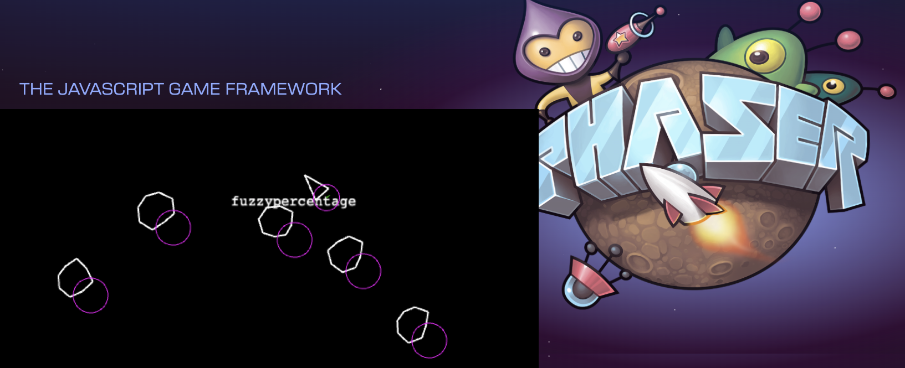

# Phaser Asteroids



A demo showcasing seamless multiplayer integration with Phaser using a drop-in DataManager-compatible networking layer. This project demonstrates how to add multiplayer to Phaser games with minimal boilerplate while maintaining a familiar, Phaser-native development experience.

## Key Features

- **Native Phaser Integration**: Uses Phaser's built-in DataManager pattern - no need to learn new paradigms
- **Minimal Boilerplate**: Add multiplayer with just a few lines of code
- **Familiar Development**: Write multiplayer code that feels like regular Phaser development
- **Drop-in Installation**: Designed to be extracted as an npm package for easy integration

## Quick Start

```typescript
// Client-side: Use exactly like Phaser's DataManager
const playersData = new SyncedDataManager("players", scene);
playersData.set("player1", { x: 100, y: 100 });

// Server handles synchronization automatically
const server = new PhaserGameServer("MyGame");
export default server.build();
```

## Demo Overview

This Asteroids clone demonstrates the library's capabilities through:

- Real-time player movement synchronization
- Shared game state
- Player join/leave handling
- All using familiar Phaser patterns

## Library Features

### Client-Side

- Drop-in replacement for Phaser's DataManager
- Automatic state synchronization
- Built-in networking and serialization
- Screen ID management

### Server-Side

- Automatic state management
- Built on Redis for scalability
- Easy subscription management
- Minimal configuration required

## Project Structure

```
src/
├── lib/                # The common library code (soon-to-be an npm package)
│   ├── client/         # Drop-in Phaser DataManager replacement
│   └── srv/            # Simple server setup
├── client/             # Demo game implementation
└── main.ts             # Minimal server setup
```

## Implementation Example

Here's how easy it is to add multiplayer features:

```typescript
// 1. Client-side: Create a synced data manager
const playersSync = new SyncedDataManager("players", this);

// 2. Use it like regular Phaser DataManager
playersSync.set(playerId, {
  x: player.x,
  y: player.y,
  angle: player.angle,
});

// 3. Listen for changes
playersSync.events.on("changedata", (parent, key, value) => {
  updatePlayerPosition(key, value);
});

// 4. Server-side: Just initialize the server
const server = new PhaserGameServer("GameName");
export default server.build();
```

## Development Status

This project serves as a reference implementation for the multiplayer library. The code in `src/lib` will be extracted into its own npm package for easy integration into other Phaser projects.

### Coming Soon

- Standalone npm package
- Additional examples and templates
- Extended documentation
- Configuration options
- More networking features

## [Game Demo](https://www.reddit.com/r/fuzzytest/comments/1hhawz3/test_asteroid/)

(open two windows)

The Asteroids game demonstrates the library's capabilities through:

- Real-time ship movement synchronization
- Shared asteroid positions
- Player names and states
- Physics synchronization
- Screen wrapping

## Getting Started

1. Install dependencies:

```bash
npm i -g devvit
npm i
```

2. Deploy on reddit

```bash
devvit upload
devvit playtest r/yourcommunity
```

## Controls

- Click/tap to rotate and move your ship
- Ships wrap around screen edges
- Collide with asteroids
- See other players in real-time
